# libassert <!-- omit in toc -->

[](https://github.com/jeremy-rifkin/libassert/actions/workflows/build.yml)
[](https://github.com/jeremy-rifkin/libassert/actions/workflows/tests.yml)
[](https://sonarcloud.io/summary/new_code?id=jeremy-rifkin_libassert)
<br/>
[-Community%20Discord-blue?labelColor=2C3239&color=7289DA&style=flat&logo=discord&logoColor=959DA5)](https://discord.gg/frjaAZvqUZ)
<!--
<br/>
[](https://godbolt.org/z/Eonafvxof)
-->

<p align="center">The most over-engineered C++ assertion library</p>

## Table of Contents: <!-- omit in toc -->
- [30-Second Overview](#30-second-overview)
  - [CMake FetchContent Usage](#cmake-fetchcontent-usage)
- [Philosophy](#philosophy)
- [Features](#features)
  - [Custom Failure Handlers](#custom-failure-handlers)
  - [Smart literal formatting](#smart-literal-formatting)
  - [Integrations with Catch2 and GoogleTest](#integrations-with-catch2-and-googletest)
- [Methodology](#methodology)
- [Considerations](#considerations)
- [In-Depth Library Documentation](#in-depth-library-documentation)
  - [Assertion Macros](#assertion-macros)
    - [Parameters](#parameters)
    - [Return value](#return-value)
  - [General Utilities](#general-utilities)
  - [Terminal Utilities](#terminal-utilities)
  - [Configuration](#configuration)
  - [Assertion information](#assertion-information)
    - [Anatomy of Assertion Information](#anatomy-of-assertion-information)
  - [Stringification of Custom Objects](#stringification-of-custom-objects)
  - [Custom Failure Handlers](#custom-failure-handlers-1)
  - [Other Donfigurations](#other-donfigurations)
- [Integration with Test Libraries](#integration-with-test-libraries)
  - [Catch2](#catch2)
  - [GoogleTest](#googletest)
- [Usage](#usage)
  - [CMake FetchContent](#cmake-fetchcontent)
  - [System-Wide Installation](#system-wide-installation)
  - [Local User Installation](#local-user-installation)
  - [Use Without CMake](#use-without-cmake)
  - [Package Managers](#package-managers)
    - [Conan](#conan)
    - [Vcpkg](#vcpkg)
- [Platform Logistics](#platform-logistics)
- [Replacing \<cassert\>](#replacing-cassert)
- [FAQ](#faq)
- [Cool projects using libassert](#cool-projects-using-libassert)
- [Comparison With Other Languages](#comparison-with-other-languages)

# 30-Second Overview

**Library philosophy:** Provide as much helpful diagnostic info as possible.

**Some of the awesome things the library does:**

```cpp
void zoog(const std::map<std::string, int>& map) {
    DEBUG_ASSERT(map.contains("foo"), "expected key not found", map);
}
```
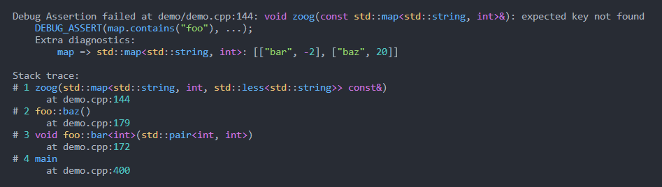

```cpp
ASSERT(vec.size() > min_items(), "vector doesn't have enough items", vec);
```
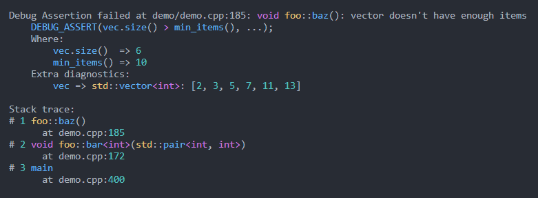

```cpp
std::optional<float> get_param();
float f = *ASSERT_VAL(get_param());
```
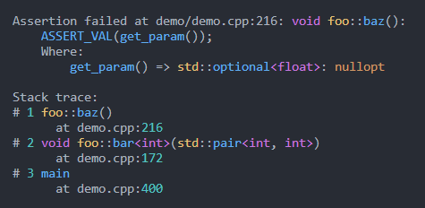

**Types of assertions:**

Conditional assertions:

- `DEBUG_ASSERT`: Checked in debug but but does nothing in release (analogous to the standard library's `assert`)
- `ASSERT`: Checked in both debug and release
- `ASSUME`: Checked in debug and serves as an optimization hint in release

Unconditional assertions:
- `PANIC`: Triggers in both debug and release
- `UNREACHABLE`: Triggers in debug, marked as unreachable in release

**Prefer lowecase `assert`?**

You can enable the lowercase `debug_assert` and `assert` aliases with `-DLIBASSERT_LOWERCASE`.

**Summary of features:**

- Automatic decomposition of assertion expressions without macros such as `ASSERT_EQ` etc.
- Assertion messages
- Arbitrary extra diagnostics
- Syntax highlighting
- Stack traces
- `DEBUG_ASSERT_VAL` and `ASSERT_VAL` variants that return a value so they can be integrated seamlessly into code, e.g.
  `FILE* f = ASSERT_VAL(fopen(path, "r") != nullptr)`.
- Smart literal formatting
- Stringification of user-defined types
- Custom failure handlers
- Catch2/Gtest integrations
- {fmt} support

## CMake FetchContent Usage

```cmake
include(FetchContent)
FetchContent_Declare(
  libassert
  GIT_REPOSITORY https://github.com/jeremy-rifkin/libassert.git
  GIT_TAG        v2.0.2 # <HASH or TAG>
)
FetchContent_MakeAvailable(libassert)
target_link_libraries(your_target libassert::assert)

# On windows copy libassert.dll to the same directory as the executable for your_target
if(WIN32)
  add_custom_command(
    TARGET your_target POST_BUILD
    COMMAND ${CMAKE_COMMAND} -E copy_if_different
    $<TARGET_FILE:libassert::assert>
    $<TARGET_FILE_DIR:your_target>
  )
endif()
```

Be sure to configure with `-DCMAKE_BUILD_TYPE=Debug` or `-DDCMAKE_BUILD_TYPE=RelWithDebInfo` for symbols and line
information.

On macOS it is recommended to generate a .dSYM file, see [Platform Logistics](#platform-logistics) below.

For other ways to use the library, such as through package managers or a system-wide installation, see [Usage](#usage)
below.

# Philosophy

Fundamentally the role of assertions is to verify assumptions made in software and identify violations close to their
sources. Assertion tooling should prioritize providing as much information and context to the developer as possible to
allow for speedy triage. Unfortunately, existing language and library tooling provides very limited triage information.

For example with stdlib assertions an assertion such as `assert(n <= 12);` provides no information upon failure about
why it failed or what lead to its failure. Providing a stack trace and the value of `n` greatley improves triage and
debugging. Ideally an assertion failure should provide enough diagnostic information that the programmmer doesn't have
to rerun in a debugger to pinpoint the problem.

Version 1 of this library was an exploration looking at how much helpful information and functionality could be packed
into assertions while also providing a quick and easy interface for the developer.

Version 2 of this library takes lessons learned from version 1 to create a tool that I personally have found
indispensable in development.

# Features

## Automatic Expression Decomposition <!-- omit in toc -->
The most important feature this library supports is automatic expression decomposition. No need for `ASSERT_LT` or other
such hassle, `assert(vec.size() > 10);` is automatically understood, as showcased above.

## Expression Diagnostics <!-- omit in toc -->
Values involved in assert expressions are displayed. Redundant diagnostics like `2 => 2` are avoided.

```cpp
DEBUG_ASSERT(map.count(1) == 2);
```

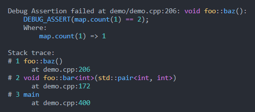

Only the full assert expression is able to be extracted from a macro call. Showing which parts of the expression
correspond to what values requires some basic expression parsing. C++ grammar is ambiguous but most expressions can be
disambiguated.

## Extra Diagnostics <!-- omit in toc -->

All assertions in this library support optional diagnostic messages as well as arbitrary other diagnostic messages.

```cpp
FILE* f = ASSERT_VAL(fopen(path, "r") != nullptr, "Internal error with foobars", errno, path);
```

Special handling is provided for `errno`, and strerror is automatically called.

Note: Extra diagnostics are only evaluated in the failure path of an assertion.

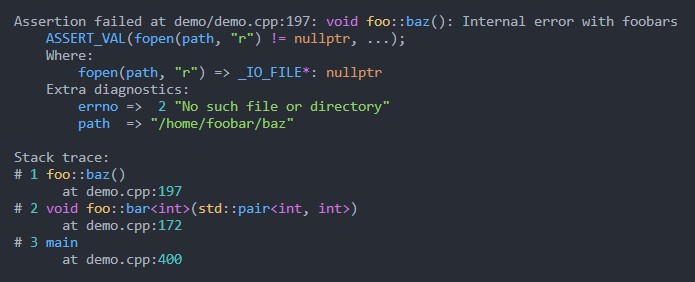

## Stack Traces <!-- omit in toc -->

A lot of work has been put into generating pretty stack traces and formatting them as nicely as possible.
[Cpptrace](https://github.com/jeremy-rifkin/cpptrace) is used as a portable and self-contained solution for stacktraces
pre-C++23. Optional configurations can be found in the library's documentation.

One feature worth noting is that instead of always printing full paths, only the minimum number of directories needed to
differentiate paths are printed.

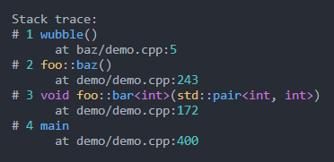

Another feature worth pointing out is that the stack traces will fold traces with deep recursion:

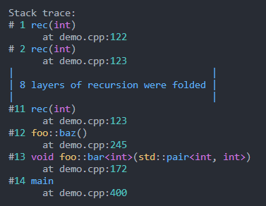

## Syntax Highlighting <!-- omit in toc -->

The assertion handler applies syntax highlighting wherever appropriate, as seen in all the
screenshots above. This is to help enhance readability.

## Custom Failure Handlers

Libassert supports custom assertion failure handlers:

```cpp
void handler(assert_type type, const assertion_info& assertion) {
    throw std::runtime_error("Assertion failed:\n" + assertion.to_string());
}

int main() {
    libassert::set_failure_handler(handler);
}
```

## Debug Stringification <!-- omit in toc -->

A lot of care is given to producing debug stringifications of values as effectively as possible: Strings, characters,
numbers, should all be printed as you'd expect. Additionally containers, tuples, std::optional, smart pointers, etc. are
all stringified to show as much information as possible. If a user defined type overloads `operator<<(std::ostream& o,
const S& s)`, that overload will be called. Otherwise it a default message will be printed. Additionally, a
stringification customiztaion point is provided:

```cpp
template<> struct libassert::stringifier<MyObject> {
    std::string stringify(const MyObject& type) {
        return ...;
    }
};
```

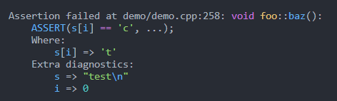

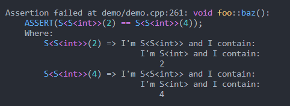

## Smart literal formatting

Assertion values are printed in hex or binary as well as decimal if hex/binary are used on either
side of an assertion expression:

```cpp
ASSERT(get_mask() == 0b00001101);
```

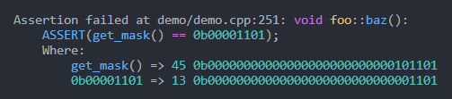

## Safe Comparisons <!-- omit in toc -->

Because expressions are already being automatically decomposed, you can opt into having signed-unsigned comparisons done
automatically done with sign safety with `-DLIBASSERT_SAFE_COMPARISONS`:

```cpp
ASSERT(18446744073709551606ULL == -10);
```

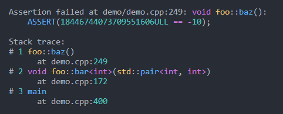


## Integrations with Catch2 and GoogleTest

Libassert provides two headers `<libassert/assert-catch2.hpp>` and `<libassert/assert-gtest.hpp>` for use with catch2
and GoogleTest.

Example output from gtest:

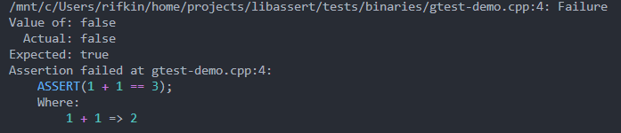

More information [below](#integration-with-test-libraries).

# Methodology

Libassert provides three types of assertions, each varying slightly depending on when it should be checked and how it
should be interpreted:

| Name           | Effect                                                                               |
| -------------- | ------------------------------------------------------------------------------------ |
| `DEBUG_ASSERT` | Checked in debug, no codegen in release                                              |
| `ASSERT`       | Checked in both debug and release builds                                             |
| `ASSUME`       | Checked in debug, `if(!(expr)) { __builtin_unreachable(); }` in release              |

Unconditional assertions
| Name          | Effect                                                |
| ------------- | ----------------------------------------------------- |
| `PANIC`       | Triggers in both debug and release                    |
| `UNREACHABLE` | Triggered in debug, marked as unreachable in release. |

One benefit to `PANIC` and `UNREACHABLE` over `ASSERT(false, ...)` is that the compiler gets `[[noreturn]]` information.

`ASSUME` marks the fail path as unreachable in release, potentially providing helpful information to the optimizer. This
isn't the default behavior for all assertions because the immediate consequence of this is that assertion failure in
`-DNDEBUG` can lead to UB and it's better to make this very explicit.

Assertion variants that can be used in-line in an expression, such as
`FILE* file = ASSERT_VAL(fopen(path, "r"), "Failed to open file");`, are also available:

| Name               | Effect                                                                  |
| ------------------ | ----------------------------------------------------------------------- |
| `DEBUG_ASSERT_VAL` | Checked in debug, must be evaluated in both debug and release           |
| `ASSERT_VAl`       | Checked in both debug and release builds                                |
| `ASSUME_VAL`       | Checked in debug, `if(!(expr)) { __builtin_unreachable(); }` in release |

Note: Even in release builds the expression for `DEBUG_ASSERT_VAL` must still be evaluated, unlike `DEBUG_ASSERT`. Of
course, if the result is unused and produces no side effects it will be optimized away.

# Considerations

**Performance:** As far as runtime performance goes, the impact at callsites is very minimal under `-Og` or higher. The fast-path in the
code (i.e., where the assertion does not fail), will be fast. A lot of work is required to process assertion failures
once they happen. However, since failures should be rare, this should not matter.

**Compile speeds:**, there is a compile-time cost associated with all the template instantiations required for this library's
magic.

**Other:**

> [!NOTE]
> Because of expression decomposition, `ASSERT(1 = 2);` compiles.

# In-Depth Library Documentation

## Assertion Macros

All assertion functions are macros. Here are some pseudo-declarations for interfacing with them:

```cpp
void DEBUG_ASSERT              (expression, [optional message], [optional extra diagnostics, ...]);
void ASSERT                    (expression, [optional message], [optional extra diagnostics, ...]);
void ASSUME                    (expression, [optional message], [optional extra diagnostics, ...]);
decltype(auto) DEBUG_ASSERT_VAL(expression, [optional message], [optional extra diagnostics, ...]);
decltype(auto) ASSERT_VAL      (expression, [optional message], [optional extra diagnostics, ...]);
decltype(auto) ASSUME_VAL      (expression, [optional message], [optional extra diagnostics, ...]);

void PANIC      ([optional message], [optional extra diagnostics, ...]);
void UNREACHABLE([optional message], [optional extra diagnostics, ...]);
```

`-DLIBASSERT_PREFIX_ASSERTIONS` can be used to prefix these macros with `LIBASSERT_`. This is useful for wrapping
libassert assertions.

`-DLIBASSERT_LOWERCASE` can be used to enable the `debug_assert` and `assert` aliases for `DEBUG_ASSERT` and `ASSERT`.
See: [Replacing &lt;cassert&gt;](#replacing-cassert).

### Parameters

#### `expression` <!-- omit in toc -->

The `expression` is automatically decomposed so diagnostic information can be provided. The resultant type must be
convertible to boolean.

The operation between left and right hand sides of the top-level operation in the expression tree is evaluated by a
function object.

Note: Boolean logical operators (`&&` and `||`) are not decomposed by default due to short circuiting.

#### `assertion message` <!-- omit in toc -->

An optional assertion message may be provided. If the first argument following the assertion expression, or the first
argument in PANIC/UNREACHABLE, is any string type it will be used as the message (if you want the first parameter, which
happens to be a string, to be an extra diagnostic value instead simply pass an empty string first, i.e.
`ASSERT(foo, "", str);`).

Note: The assertion message expression is only evaluated in the failure path of the assertion.

#### `extra diagnostics` <!-- omit in toc -->

An arbitrary number of extra diagnostic values may be provided. These are displayed below the expression diagnostics if
a check fails.

Note: Extra diagnostics are only evaluated in the failure path of the assertion.

There is special handling when `errno` is provided: The value of `strerror` is displayed automatically.

### Return value

To facilitate ease of integration into code `_VAL` variants are provided which return a value from the assert
expression. The returned value is determined as follows:

- If there is no top-level binary operation (e.g. as in `ASSERT_VAL(foo());` or `ASSERT_VAL(false);`) in the assertion
  expression, the value of the expression is simply returned.
- Otherwise if the top-level binary operation is `==`, `!=`, `<`, `<=`, `>`, `>=`, `&&`, `||`, or or any assignment or
  compound assignment then the value of the __left-hand operand__ is returned.
- Otherwise if the top-level binary operation is `&`, `|`, `^`, `<<`, `>>`, or any binary operator with precedence above
  bitshift then value of the whole expression is returned.

I.e., `ASSERT_VAL(foo() > 2);` returns the computed result from `foo()` and `ASSERT_VAL(x & y);` returns the computed
result of `x & y`;

If the value from the assertion expression selected to be returned is an lvalue, the type of the assertion call will be
an lvalue reference. If the value from the assertion expression is an rvalue then the type of the call will be an
rvalue.

## General Utilities

```cpp
namespace libassert {
    [[nodiscard]] std::string stacktrace(
        int width = 0,
        const color_scheme& scheme = get_color_scheme(),
        std::size_t skip = 0
    );
    template<typename T> [[nodiscard]] std::string_view type_name() noexcept;
    template<typename T> [[nodiscard]] std::string pretty_type_name() noexcept;
    template<typename T> [[nodiscard]] std::string stringify(const T& value);
}
```

- `stacktrace`: Generates a stack trace, formats to the given width (0 for no width formatting)
- `type_name`: Returns the type name of T
- `pretty_type_name`: Returns the prettified type name for T
- `stringify`: Produces a debug stringification of a value

## Terminal Utilities

```cpp
namespace libassert {
    void enable_virtual_terminal_processing_if_needed();
    inline constexpr int stdin_fileno = 0;
    inline constexpr int stdout_fileno = 1;
    inline constexpr int stderr_fileno = 2;
    bool isatty(int fd);
    [[nodiscard]] int terminal_width(int fd);
}
```

- `enable_virtual_terminal_processing_if_needed`: Enable ANSI escape sequences for terminals on windows, needed for
  color output.
- `isatty`: Returns true if the file descriptor corresponds to a terminal
- `terminal_width`: Returns the width of the terminal represented by fd or 0 on error

## Configuration

### Color Scheme: <!-- omit in toc -->

```cpp
namespace libassert {
    // NOTE: string view underlying data should have static storage duration, or otherwise live as
    // long as the scheme is in use
    struct color_scheme {
        std::string_view string, escape, keyword, named_literal, number, punctuation, operator_token,
                    call_identifier, scope_resolution_identifier, identifier, accent, unknown, reset;
        static const color_scheme ansi_basic;
        static const color_scheme ansi_rgb;
        static const color_scheme blank;
    };
    void set_color_scheme(const color_scheme&);
    const color_scheme& get_color_scheme();
}
```

By default `color_scheme::ansi_rgb` is used. To disable colors, use `color_scheme::blank`.

- `set_color_scheme`: Sets the color scheme for the default assertion handler when stderr is a terminal

### Separator: <!-- omit in toc -->

```cpp
namespace libassert {
    void set_separator(std::string_view separator);
}
```

- `set_separator`: Sets the separator between expression and value in assertion diagnostic output. Default: `=>`. NOTE:
  Not thread-safe.

### Literal formatting mode: <!-- omit in toc -->

```cpp
namespace libassert {
    enum class literal_format_mode {
        infer, // infer literal formats based on the assertion condition
        no_variations, // don't do any literal format variations, just default
        fixed_variations // always use a fixed set of formats (in addition to the default format)
    };
    void set_literal_format_mode(literal_format_mode);

    enum class literal_format : unsigned {
        // integers and floats are decimal by default, chars are of course chars, and everything
        // else only has one format that makes sense
        default_format = 0,
        integer_hex = 1,
        integer_octal = 2,
        integer_binary = 4,
        integer_character = 8, // format integers as characters and characters as integers
        float_hex = 16,
    };
    [[nodiscard]] constexpr literal_format operator|(literal_format a, literal_format b);
    void set_fixed_literal_format(literal_format);
}
```

- `set_literal_format_mode`: Sets whether the library should show literal variations or infer them
- `set_fixed_literal_format`: Set a fixed literal format configuration, automatically changes the literal_format_mode;
  note that the default format will always be used along with others

### Path mode: <!-- omit in toc -->

```cpp
namespace libassert {
    enum class path_mode {
        full, // full path is used
        disambiguated, // only enough folders needed to disambiguate are provided
        basename, // only the file name is used
    };
    LIBASSERT_EXPORT void set_path_mode(path_mode mode);
}
```

- `set_path_mode`: Sets the path shortening mode for assertion output. Default: `path_mode::disambiguated`.

## Assertion information

```cpp
namespace libassert {
    enum class assert_type {
        debug_assertion,
        assertion,
        assumption,
        panic,
        unreachable
    };

    struct LIBASSERT_EXPORT binary_diagnostics_descriptor {
        std::string left_expression;
        std::string right_expression;
        std::string left_stringification;
        std::string right_stringification;
    };

    struct extra_diagnostic {
        std::string_view expression;
        std::string stringification;
    };

    struct LIBASSERT_EXPORT assertion_info {
        std::string_view macro_name;
        assert_type type;
        std::string_view expression_string;
        std::string_view file_name;
        std::uint32_t line;
        std::string_view function;
        std::optional<std::string> message;
        std::optional<binary_diagnostics_descriptor> binary_diagnostics;
        std::vector<extra_diagnostic> extra_diagnostics;
        size_t n_args;

        std::string_view action() const;

        const cpptrace::raw_trace& get_raw_trace() const;
        const cpptrace::stacktrace& get_stacktrace() const;

        [[nodiscard]] std::string header(int width = 0, const color_scheme& scheme = get_color_scheme()) const;
        [[nodiscard]] std::string tagline(const color_scheme& scheme = get_color_scheme()) const;
        [[nodiscard]] std::string location() const;
        [[nodiscard]] std::string statement(const color_scheme& scheme = get_color_scheme()) const;
        [[nodiscard]] std::string print_binary_diagnostics(int width = 0, const color_scheme& scheme = get_color_scheme()) const;
        [[nodiscard]] std::string print_extra_diagnostics(int width = 0, const color_scheme& scheme = get_color_scheme()) const;
        [[nodiscard]] std::string print_stacktrace(int width = 0, const color_scheme& scheme = get_color_scheme()) const;

        [[nodiscard]] std::string to_string(int width = 0, const color_scheme& scheme = get_color_scheme()) const;
    };
}
```

### Anatomy of Assertion Information

```
Debug Assertion failed at demo.cpp:194: void foo::baz(): Internal error with foobars
    debug_assert(open(path, 0) >= 0, ...);
    Where:
        open(path, 0) => -1
    Extra diagnostics:
        errno =>  2 "No such file or directory"
        path  => "/home/foobar/baz"

Stack trace:
#1 demo.cpp:194 foo::baz()
#2 demo.cpp:172 void foo::bar<int>(std::pair<int, int>)
#3 demo.cpp:396 main
```

- `Debug Assertion failed`: `assertion_info.action()`
- `demo.cpp:194`: `assertion_info.file_name` and `assertion_info.line`
- `void foo::baz()`: `assertion_info.pretty_function`
- `Internal error with foobars`: `assertion_info.message`
- `debug_assert`: `assertion_info.macro_name`
- `open(path, 0) >= 0`: `assertion_info.expression_string`
- `...`: determined by `assertion_info.n_args` which has the total number of arguments passed to the assertion macro
- Where clause
  - `open(path, 0)`: `assertion_info.binary_diagnostics.left_expression`
  - `-1`: `assertion_info.binary_diagnostics.left_stringification`
  - Same for the right side (omitted in this case because `0 => 0` isn't useful)
- Extra diagnostics
  - `errno`: `assertion_info.extra_diagnostics[0].expression`
  - `2 "No such file or directory"`: `assertion_info.extra_diagnostics[0].stringification`
  - ... etc.
- Stack trace
  - `assertion_info.get_stacktrace()`, or `assertion_info.get_raw_trace()` to get the trace without resolving it

**Helpers:**

`assertion_info.header()`:

```
Debug Assertion failed at demo.cpp:194: void foo::baz(): Internal error with foobars
    debug_assert(open(path, 0) >= 0, ...);
    Where:
        open(path, 0) => -1
    Extra diagnostics:
        errno =>  2 "No such file or directory"
        path  => "/home/foobar/baz"
```

`assertion_info.tagline()`:

```
Debug Assertion failed at demo.cpp:194: void foo::baz(): Internal error with foobars
```

`assertion_info.location()`:

> [!NOTE]
> Path processing will be performed according to the path mode

```
demo.cpp:194
```

`assertion_info.statement()`:

```
    debug_assert(open(path, 0) >= 0, ...);
```

`assertion_info.print_binary_diagnostics()`:

```
    Where:
        open(path, 0) => -1
```

`assertion_info.print_extra_diagnostics()`:

```
    Extra diagnostics:
        errno =>  2 "No such file or directory"
        path  => "/home/foobar/baz"
```

`assertion_info.print_stacktrace()`:

```
Stack trace:
#1 demo.cpp:194 foo::baz()
#2 demo.cpp:172 void foo::bar<int>(std::pair<int, int>)
#3 demo.cpp:396 main
```

## Stringification of Custom Objects

Libassert provides a customization point for user-defined types:

```cpp
template<> struct libassert::stringifier<MyObject> {
    std::string stringify(const MyObject& type) {
        return ...;
    }
};
```

By default any container-like user-defined types will be automatically stringifiable.

Additionally, `LIBASSERT_USE_FMT` can be used to allow libassert to use `fmt::formatter`s.

Lastly, any types with an ostream `operator<<` overload can be stringified.

## Custom Failure Handlers

```cpp
namespace libassert {
    void set_failure_handler(void (*handler)(const assertion_info&));
}
```

- `set_failure_handler`: Sets the assertion handler for the program.

An example assertion handler similar to the default handler:

```cpp
void libassert_default_failure_handler(const assertion_info& info) {
    libassert::enable_virtual_terminal_processing_if_needed(); // for terminal colors on windows
    std::string message = info.to_string(
        libassert::terminal_width(libassert::stderr_fileno),
        libassert::isatty(libassert::stderr_fileno)
            ? libassert::get_color_scheme()
            : libassert::color_scheme::blank
    );
    std::cerr << message << std::endl;
    switch(info.type) {
        case libassert::assert_type::assertion:
        case libassert::assert_type::debug_assertion:
        case libassert::assert_type::assumption:
        case libassert::assert_type::panic:
        case libassert::assert_type::unreachable:
            (void)fflush(stderr);
            std::abort();
            // Breaking here as debug CRT allows aborts to be ignored, if someone wants to make a
            // debug build of this library
            break;
        default:
            std::cerr << "Critical error: Unknown libassert::assert_type" << std::endl;
            std::abort(1);
    }
}
```

By default libassert aborts from all assertion types. However, it may be desirable to throw an exception from some or
all assertion types instead of aborting.

> [!IMPORTANT]
> Failure handlers must not return for `assert_type::panic` and `assert_type::unreachable`.

## Other Donfigurations

**Defines:**

- `LIBASSERT_USE_MAGIC_ENUM`: Use magic enum for stringifying enum values
- `LIBASSERT_DECOMPOSE_BINARY_LOGICAL`: Decompose `&&` and `||`
- `LIBASSERT_SAFE_COMPARISONS`: Enable safe signed-unsigned comparisons for decomposed expressions
- `LIBASSERT_PREFIX_ASSERTIONS`: Prefixes all assertion macros with `LIBASSERT_`
- `LIBASSERT_USE_FMT`: Enables libfmt integration
- `LIBASSERT_NO_STRINGIFY_SMART_POINTER_OBJECTS`: Disables stringification of smart pointer contents

**CMake:**
- `LIBASSERT_USE_EXTERNAL_CPPTRACE`: Use an externam cpptrace instead of aquiring the library with FetchContent
- `LIBASSERT_USE_EXTERNAL_MAGIC_ENUM`: Use an externam magic enum instead of aquiring the library with FetchContent

# Integration with Test Libraries

> [!NOTE]
> Because of MSVC's non-conformant preprocessor there is no easy way to provide assertion wrappers. In order to use test
> library integrations `/Zc:preprocessor` is required.

## Catch2

Libassert provides a catch2 integration in `libassert/assert-catch2.hpp`:

```cpp
#include <libassert/assert-catch2.hpp>

TEST_CASE("1 + 1 is 2") {
    ASSERT(1 + 1 == 3);
}
```

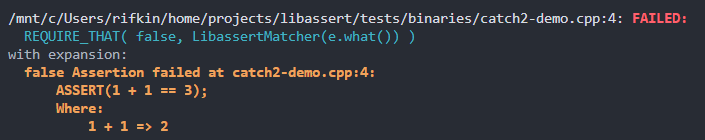

Currently the only macro provided is `ASSERT`, which will perform a `REQUIRE` internally.

This isn't as pretty as I would like, however, it gets the job done. I'd like to support syntax highlighting however
unfortunately catch2's line wrapping does not take into account ANSI escape sequences at the moment.

## GoogleTest

Libassert provides a gtest integration in `libassert/assert-gtest.hpp`:

```cpp
#include <libassert/assert-gtest.hpp>

TEST(Addition, Arithmetic) {
    ASSERT(1 + 1 == 3);
}
```


Currently libassert provides `ASSERT` and `EXPECT` macros for gtest.

This isn't as pretty as I would like, however, it gets the job done.

# Usage

This library targets >=C++17 and supports all major compilers and all major platforms (linux, macos, windows, and
mingw).

Note: The library does rely on some compiler extensions and compiler specific features so it is not compatible with
`-pedantic`.

## CMake FetchContent

With CMake FetchContent:

```cmake
include(FetchContent)
FetchContent_Declare(
  libassert
  GIT_REPOSITORY https://github.com/jeremy-rifkin/libassert.git
  GIT_TAG        v2.0.2 # <HASH or TAG>
)
FetchContent_MakeAvailable(libassert)
target_link_libraries(your_target libassert::assert)
```

Note: On windows and macos some extra work is recommended, see [Platform Logistics](#platform-logistics) below.

Be sure to configure with `-DCMAKE_BUILD_TYPE=Debug` or `-DDCMAKE_BUILD_TYPE=RelWithDebInfo` for symbols and line
information.

## System-Wide Installation

```sh
git clone https://github.com/jeremy-rifkin/libassert.git
git checkout v2.0.2
mkdir libassert/build
cd libassert/build
cmake .. -DCMAKE_BUILD_TYPE=Release
make -j
sudo make install
```

Using through cmake:
```cmake
find_package(libassert REQUIRED)
target_link_libraries(<your target> libassert::assert)
```
Be sure to configure with `-DCMAKE_BUILD_TYPE=Debug` or `-DDCMAKE_BUILD_TYPE=RelWithDebInfo` for symbols and line
information.

Or compile with `-lassert`:

```sh
g++ main.cpp -o main -g -Wall -lassert
./main
```

If you get an error along the lines of
```
error while loading shared libraries: libassert.so: cannot open shared object file: No such file or directory
```
You may have to run `sudo /sbin/ldconfig` to create any necessary links and update caches so the system can find
libcpptrace.so (I had to do this on Ubuntu). Only when installing system-wide. Usually your package manger does this for
you when installing new libraries.

<details>
    <summary>System-wide install on windows</summary>

```ps1
git clone https://github.com/jeremy-rifkin/libassert.git
git checkout v2.0.2
mkdir libassert/build
cd libassert/build
cmake .. -DCMAKE_BUILD_TYPE=Release
msbuild libassert.sln
msbuild INSTALL.vcxproj
```

Note: You'll need to run as an administrator in a developer powershell, or use vcvarsall.bat distributed with visual
studio to get the correct environment variables set.
</details>

## Local User Installation

To install just for the local user (or any custom prefix):

```sh
git clone https://github.com/jeremy-rifkin/libassert.git
git checkout v2.0.2
mkdir libassert/build
cd libassert/build
cmake .. -DCMAKE_BUILD_TYPE=Release -DCMAKE_INSTALL_PREFIX=$HOME/wherever
make -j
sudo make install
```

Using through cmake:
```cmake
find_package(libassert REQUIRED PATHS $ENV{HOME}/wherever)
target_link_libraries(<your target> libassert::assert)
```

Using manually:
```
g++ main.cpp -o main -g -Wall -I$HOME/wherever/include -L$HOME/wherever/lib -lassert
```

## Use Without CMake

To use the library without cmake first follow the installation instructions at
[System-Wide Installation](#system-wide-installation), [Local User Installation](#local-user-installation),
or [Package Managers](#package-managers).

Use the following arguments to compile with libassert:

| Compiler                | Platform         | Dependencies                                              |
| ----------------------- | ---------------- | --------------------------------------------------------- |
| gcc, clang, intel, etc. | Linux/macos/unix | `-libassert -I[path] [cpptrace args]` |
| mingw                   | Windows          | `-libassert -I[path] [cpptrace args]` |
| msvc                    | Windows          | `assert.lib /I[path] [cpptrace args]` |
| clang                   | Windows          | `-libassert -I[path] [cpptrace args]` |

For the `[path]` placeholder in `-I[path]` and `/I[path]`, specify the path to the include folder containing
`libassert/assert.hpp`.

If you are linking statically, you will additionally need to specify `-DLIBASSERT_STATIC_DEFINE`.

For the `[cpptrace args]` placeholder refer to the [cpptrace documentation](https://github.com/jeremy-rifkin/cpptrace?tab=readme-ov-file#use-without-cmake).

## Package Managers

### Conan

Libassert is available through conan at https://conan.io/center/recipes/libassert.

```
[requires]
libassert/2.0.2
[generators]
CMakeDeps
CMakeToolchain
[layout]
cmake_layout
```
```cmake
# ...
find_package(libassert REQUIRED)
# ...
target_link_libraries(YOUR_TARGET libassert::assert)
```

### Vcpkg

```
vcpkg install libassert
```
```cmake
find_package(libassert CONFIG REQUIRED)
target_link_libraries(YOUR_TARGET PRIVATE libassert::assert)
```

# Platform Logistics

Windows and macos require a little extra work to get everything in the right place

Copying the library .dll on windows:

```cmake
# Copy the assert.dll on windows to the same directory as the executable for your_target.
# Not required if static linking.
if(WIN32)
  add_custom_command(
    TARGET your_target POST_BUILD
    COMMAND ${CMAKE_COMMAND} -E copy_if_different
    $<TARGET_FILE:libassert::assert>
    $<TARGET_FILE_DIR:your_target>
  )
endif()
```

On macOS it's recommended to generate a dSYM file containing debug information for your program:

In xcode cmake this can be done with

```cmake
set_target_properties(your_target PROPERTIES XCODE_ATTRIBUTE_DEBUG_INFORMATION_FORMAT "dwarf-with-dsym")
```

And outside xcode this can be done with `dsymutil yourbinary`:

```cmake
# Create a .dSYM file on macos. Currently required, but hopefully not for long
if(APPLE)
  add_custom_command(
    TARGET your_target
    POST_BUILD
    COMMAND dsymutil $<TARGET_FILE:your_target>
  )
endif()
```

# Replacing &lt;cassert&gt;

This library is not a drop-in replacement for `<cassert>`. `-DLIBASSERT_LOWERCASE` can be used to create lowercase aliases
for the assertion macros but be aware that libassert's `ASSERT` is still checked in release. To replace `<cassert>` use
with libassert, replace `assert` with `DEBUG_ASSERT` or create an alias along the following lines:

```cpp
#define assert(...) DEBUG_ASSERT(__VA_ARGS__)
```

One thing to be aware: Overriding cassert's `assert` is technically [not allowed][16.4.5.3.3] by the standard, but this
should not be an issue for any sane compiler.

# FAQ

## Does it have spell-check? <!-- omit in toc -->

No, not yet.

# Cool projects using libassert

- [Morwenn's `cpp-sort`](https://github.com/Morwenn/cpp-sort)

# Comparison With Other Languages

Even with constructs like `assert_eq`, assertion diagnostics are often lacking. For example, in rust the left and right
values are displayed but not the expressions themselves:

```rust
fn main() {
    let count = 4;
    assert_eq!(count, 2);
}
```
```
thread 'main' panicked at 'assertion failed: `(left == right)`
  left: `4`,
 right: `2`', /app/example.rs:3:5
note: run with `RUST_BACKTRACE=1` environment variable to display a backtrace
```

This is not as helpful as it could be.

Functionality other languages / their standard libraries provide:

|                                    | C/C++ | Rust |  C#  | Java | Python | JavaScript | Libassert |
| :--------------------------------- | :---: | :--: | :--: | :--: | :----: | :--------: | :-------: |
| Expression string                  | ✔️  |  ❌  |  ❌  |  ❌  |   ❌   |     ❌     |   ✔️    |
| Location                           | ✔️  | ✔️ | ✔️ | ✔️ |  ✔️  |    ✔️    |   ✔️    |
| Stack trace                        |  ❌   | ✔️ | ✔️ | ✔️ |  ✔️  |    ✔️    |   ✔️    |
| Assertion message                  | ❌**  | ✔️ | ✔️ | ✔️ |  ✔️  |    ✔️    |   ✔️    |
| Extra diagnostics                  |  ❌   | ❌*  | ❌*  |  ❌  |  ❌*   |    ❌*     |   ✔️    |
| Binary specializations             |  ❌   | ✔️ |  ❌  |  ❌  |   ❌   |    ✔️    |   ✔️    |
| Automatic expression decomposition |  ❌   |  ❌  |  ❌  |  ❌  |   ❌   |     ❌     |   ✔️    |
| Sub-expression strings             |  ❌   |  ❌  |  ❌  |  ❌  |   ❌   |     ❌     |   ✔️    |

`*`: Possible through string formatting but that is sub-ideal. <br/>
`**`: `assert(expression && "message")` is commonly used but this is sub-ideal and only allows string literal messages.

Extras:

|                                                                                         | C/C++ | Rust | C#  | Java | Python | JavaScript | Libassert |
| :-------------------------------------------------------------------------------------- | :---: | :--: | :-: | :--: | :----: | :--------: | :-------: |
| Syntax highlighting                                                                     |  ❌   |  ❌  | ❌  |  ❌  |  🟡   |     ❌     |   ✔️    |
| Literal formatting consistency                                                          |  ❌   |  ❌  | ❌  |  ❌  |   ❌   |     ❌     |   ✔️    |
| Expression strings and expression values everywhere                                     |  ❌   |  ❌  | ❌  |  ❌  |   ❌   |     ❌     |   ✔️    |
| Return values from the assert to allow asserts to be integrated into expressions inline |  ❌   |  ❌  | ❌  |  ❌  |   ❌   |     ❌     |   ✔️    |

[16.4.5.3.3]: https://eel.is/c++draft/reserved.names#macro.names-1
