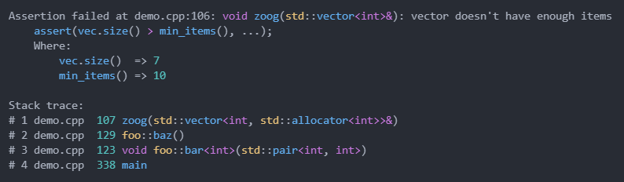
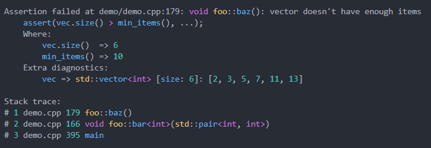
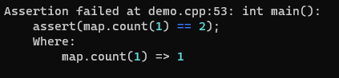
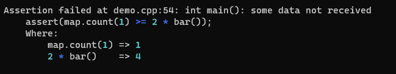
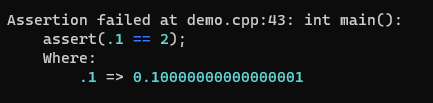
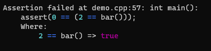
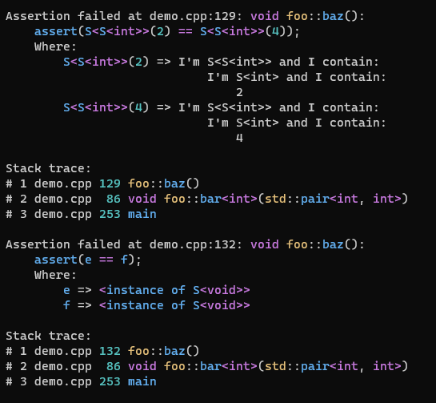
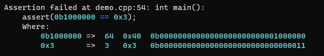
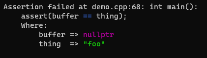
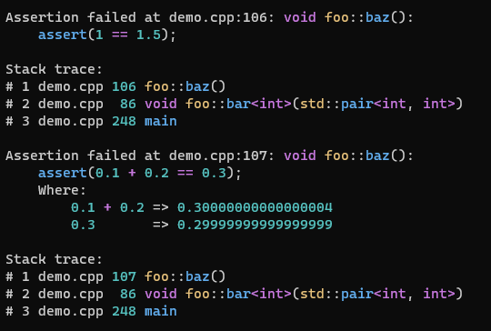

# libassert <!-- omit in toc -->

[](https://github.com/jeremy-rifkin/libassert/actions/workflows/build.yml)
[](https://github.com/jeremy-rifkin/libassert/actions/workflows/tests.yml)
[](https://sonarcloud.io/summary/new_code?id=jeremy-rifkin_libassert)
<br/>
[-Community%20Discord-blue?labelColor=2C3239&color=7289DA&style=flat&logo=discord&logoColor=959DA5)](https://discord.gg/frjaAZvqUZ)
<br/>
[](https://godbolt.org/z/Eonafvxof)

<p align="center">The most over-engineered C++ assertion library</p>

### Table of Contents: <!-- omit in toc -->
- [30-Second Overview](#30-second-overview)
- [In-Depth Library Documentation](#in-depth-library-documentation)
  - [Philosophy](#philosophy)
  - [Methodology](#methodology)
  - [Considerations](#considerations)
  - [Features](#features)
  - [Documentation](#documentation)
    - [Parameters](#parameters)
    - [Return value](#return-value)
    - [Failure](#failure)
    - [Configuration](#configuration)
    - [Debug Stringification](#debug-stringification)
      - [User-Defined Types](#user-defined-types)
    - [Utilities](#utilities)
    - [Namespace synopsis](#namespace-synopsis)
  - [How To Use This Library](#how-to-use-this-library)
    - [A) With CMake `FetchContent`](#a-with-cmake-fetchcontent)
    - [B) Manual Build](#b-manual-build)
    - [1. Build](#1-build)
    - [2. Install](#2-install)
    - [3. Use](#3-use)
  - [Replacing \<cassert\>](#replacing-cassert)
  - [Comparison With Other Languages](#comparison-with-other-languages)

# 30-Second Overview

**Some of the awesome things the library does:**

```cpp
void zoog(const std::map<std::string, int>& map) {
    assert(map.contains("foo"), "expected key not found", map);
}
```


```cpp
assert(vec.size() > min_items(), "vector doesn't have enough items", vec);
```


```cpp
const char* path = "/home/foobar/baz";
FILE* f = VERIFY(fopen(path, "r") != nullptr, "Internal error with foobars", errno, path);
```


```cpp
std::optional<float> get_param();
float f = *assert(get_param());
```


**Library philosophy:** Provide as much helpful diagnostic info as possible.

**Types of assertions:**

- `DEBUG_ASSERT` This is the analog for &lt;cassert&gt;: checked in debug and does nothing in release
- `ASSERT` Checked in debug but still evaluated and returned ([more below](#methodology)) in release
  - Of course, if the expression's value isn't used or doesn't have any side effects it should be eliminated by the
    optimizer
- `ASSUME` Checks core assumptions, preconditions, and postconditions in debug and provides hints to the optimizer in
  release
- `VERIFY` Checks the condition in both debug and release

**Returning a value:**

Assertions return a value so they can be integrated seamlessly into code:

- `==`, `!=`, `<`, `<=`, `>`, `>=`, `&&`, and `||` expressions return the <ins>left-hand operand</ins>
  - E.g. `VERIFY(fopen(path, "r") != nullptr)` returns the pointer from `fopen`
- Otherwise the full expression is returned
  - E.g. `ASSERT(5)` and `ASSERT(4 | 1)` return 5

**Prefer lowecase `assert`?**

Me too, you can enable the lowercase `debug_assert` and `assert` aliases with `-DASSERT_LOWERCASE`.

**Using the library:**

This library is for C++17 and newer.

Build the library with cmake. Both static and dynamic linking are supported. More details [below](#how-to-use-this-library).

---

# In-Depth Library Documentation

## Philosophy

Fundamentally the role of assertions is to verify assumptions made in software and identify
violations close to their sources. Assertion tooling should prioritize providing as much information
and context to the developer as possible to allow for speedy triage. Unfortunately, existing
language and library tooling provides very limited triage information.

For example with stdlib asserts, when `assert(n <= 12);` fails we may get no information about why
(i.e., the value of `n`) and we don't get stack trace. Ideally an assertion failure should provide
enough diagnostic information that we don't have to rerun in a debugger to pinpoint the problem.

This library is an exploration looking at how much helpful information and functionality can be
packed into assertions while also providing a quick and easy interface for the developer.

## Methodology

Different types of assumptions call for different handling and different behavior. This library implements a tiered
assertion system:

| Name           | When to Use                                                                                        | Effect                                                                                                     |
| -------------- | -------------------------------------------------------------------------------------------------- | ---------------------------------------------------------------------------------------------------------- |
| `DEBUG_ASSERT` | Core assumptions that potentially can't be optimized away (e.g. calls to `std::unordered_map::at`) | Checked in debug, no codegen in release                                                                    |
| `ASSERT`       | Core assumptions                                                                                   | Checked in debug, still evaluated and returned in release (usually elided by the optimizer if appropriate) |
| `ASSUME`       | Assumptions that can serve as hints to the optimizer                                               | Checked in debug, `if(!expr) { __builtin_unreachable(); }` in release                                      |
| `VERIFY`       | Checks that are good to have even in release                                                       | Checked in both debug and release builds                                                                   |

All assertions except `DEBUG_ASSERT` return a value from the assertion expression so checks can be seamlessly integrated
into a program's structure. Because an expression's result may still be relevant even in a release build the expression
still has to be valid and evaluated even in a release build. Of course, if the result is unused and produces no side
effects it will be optimized away (at the very least during LTO). But consequently all side effects are preserved unlike
traditional asserts. This is the motivation for `DEBUG_ASSERT`, where it's undesirable for side effects to be preserved.

`ASSUME` marks the fail path as unreachable in release, potentially providing helpful information to the optimizer. This
isn't the default behavior for all assertions because the immediate consequence of this is that assertion failure in
`-DNDEBUG` can lead to UB and it's better to make this very explicit.

All of these assertions can be marked as nonfatal by passing `ASSERTION::FATAL` which prevents aborting or throwing in
the default assertion failure handler. Except `ASSUME` which aborts regardless of being marked fatal. This can all be
customized in a custom assertion failure handler.

## Considerations

Automatic expression decomposition requires a lot of template metaprogramming shenanigans. This adds
a lot of work at the callsite just to setup an assertion expression. These calls are swiftly inlined
in an optimized build, but it is a consideration for unoptimized builds.

All the TMP work required to setup and process assertions is a consideration for build speeds, there
will be an impact on build speeds from using this library. This is the price we pay for nice things.
As stated previously, this library is a proof of concept. Doing this better might require language
support.

As far as runtime performance goes, the impact at callsites is very minimal under `-Og` or higher,
potentially even less than a stdlib assert.

A lot of work is required to process assertion failures once they happen but failures are *the
coldest* path in a binary, I'm not concerned with performance in the assertion processor as long as
it's not noticeably slow.

## Features

Here are some of the most notable features I'd like to highlight:

#### Automatic Expression Decomposition <!-- omit in toc -->
The most important feature this library supports is automatic expression decomposition. No need for
`ASSERT_LT` or other such hassle, `assert(vec.size() > 10);` is automatically understood, as
showcased above.

#### Expression Diagnostics <!-- omit in toc -->
Values involved in assert expressions are displayed. Redundant diagnostics like `7 => 7` are
avoided.

```cpp
assert(vec.size() > 7);
```



Only the full assert expression is able to be extracted from a macro call. Showing which parts of
the expression correspond to what values requires some basic expression parsing. C++ grammar is
ambiguous but most expressions can be disambiguated.

#### Extra Diagnostics <!-- omit in toc -->
All assertions in this library support optional diagnostic messages as well as arbitrary other
diagnostic messages.

```cpp
FILE* f = VERIFY(fopen(path, "r") != nullptr, "Internal error with foobars", errno, path);
```

Special handling is provided for `errno`, and strerror is automatically called.

Note: Extra diagnostics are only evaluated in the failure path of an assertion.



#### Stack Traces <!-- omit in toc -->

A lot of work has been put into generating pretty stack traces and formatting them as nicely as
possible. [Cpptrace](https://github.com/jeremy-rifkin/cpptrace) is used as a portable and
self-contained solution for stacktraces pre-C++23. Optional configurations can be found on the
library's page.

One feature worth noting is that instead of always printing full paths, only the minimum number of
directories needed to differentiate paths are printed.



Another feature worth pointing out is that the stack traces will fold deep recursion traces:


#### Automatic Safe Comparisons <!-- omit in toc -->

Because expressions are already being automatically decomposed, signed-unsigned comparisons are
automatically done with sign safety (same mechanism as C++20 `std::cmp_equal`, `std::cmp_less`,
...):

```cpp
assert(18446744073709551606ULL == -10);
```



#### Syntax Highlighting <!-- omit in toc -->

The assertion handler applies syntax highlighting wherever appropriate, as seen in all the
screenshots above. This is to help enhance readability.

#### Object Printing <!-- omit in toc -->

A lot of care is given to printing values as effectively as possible: Strings, characters, numbers,
should all be printed as you'd expect. If a user defined type overloads `operator<<(std::ostream& o,
const S& s)`, that overload will be called. Otherwise it a default message will be printed.




Assertion values are printed in hex or binary as well as decimal if hex/binary are used on either
side of an assertion expression:

```cpp
assert(get_mask() == 0b00001101);
```



## Documentation

All assertion functions are macros. Here are some pseudo-declarations for interfacing with them:

```cpp
void DEBUG_ASSERT(<expression>, [optional assertion message],
                                [optional extra diagnostics, ...], fatal?);
decltype(auto) ASSERT(<expression>, [optional assertion message],
                                    [optional extra diagnostics, ...], fatal?);
decltype(auto) ASSUME(<expression>, [optional assertion message],
                                    [optional extra diagnostics, ...], fatal?);
decltype(auto) VERIFY(<expression>, [optional assertion message],
                                    [optional extra diagnostics, ...], fatal?);
```

`-DASSERT_LOWERCASE` can be used to enable the `debug_assert` and `assert` aliases for `DEBUG_ASSERT` and `ASSERT`. See:
[Replacing &lt;cassert&gt;](#replacing-cassert).

### Parameters

#### `expression` <!-- omit in toc -->

The `<expression>` is automatically decomposed so diagnostic information can be provided. The
resultant type must be convertible to boolean.

The operation between left and right hand sides of the top-level operation in the expression tree is
evaluated by a functor.

If the operation is a comparison (`==`, `!=`, `<`, `<=`, `>`, `>=`) and the operands are integers,
the comparison is automatically done with sign safety.

Note: Boolean logical operators (`&&` and `||`) are not decomposed by default due to short
circuiting.

#### `assertion message` <!-- omit in toc -->

An optional assertion message may be provided. If the first argument following `<expression>` is any
string type it will be used as the message (if you want the first parameter, which happens to be a
string, to be an extra diagnostic value instead simply pass an empty string first, i.e.
`assert(foo, "", str);`).

#### `extra diagnostics` <!-- omit in toc -->

An arbitrary number of extra diagnostic values may be provided. These are displayed below the
expression diagnostics if a check fails.

Note: Extra diagnostics are only evaluated in the failure path of an assertion.

There is special handling when `errno` is provided: The value of `strerror` is displayed
automatically.

#### `fatal?` <!-- omit in toc -->

`ASSERT::FATAL` and `ASSERT::NONFATAL` may be passed in any position in a call. By default all
assertions, are fatal. If nonfatal, failure will simply be logged but abort isn't called
and exceptions aren't raised.

### Return value

To facilitate ease of integration into code, all asserts except `DEBUG_ASSERT` return a value from the
assert expression. The returned value is the following:

- If there is no top-level binary operation (e.g. as in `assert(foo());` or `assert(false);`) in the
  `<expression>`, the value of the expression is simply returned.
- Otherwise if the top-level binary operation is `==`, `!=`, `<`, `<=`, `>`, `>=`, `&&`, `||`, or
  or any assignment or compound assignment then the value of the __left-hand operand__ is returned.
- Otherwise if the top-level binary operation is `&`, `|`, `^`, `<<`, `>>`, or any binary operator
  with precedence above bitshift then value of the whole expression is returned.

I.e., `assert(foo() > 2);` returns the computed result from `foo()` and `assert(x & y);` returns the
computed result of `x & y`;

If the value from `<expression>` selected to be returned is an lvalue, the type of the
assertion call will be an lvalue reference. If the value from `<expression>` is an rvalue
then the type of the call will be an rvalue.

### Failure

After the assertion handler processes the failure and prints diagnostic information it will invoke
an assert failure action. These may be overridden by the user on a per-TU basis, the default
behaviors are:

| Name           | Failure                                                                  |
| -------------- | ------------------------------------------------------------------------ |
| `DEBUG_ASSERT` | `abort()` is called in debug, nothing happens in release                 |
| `ASSERT`       | `abort()` is called in debug, nothing happens in release                 |
| `ASSUME`       | `abort()` is called in debug, fail path is marked unreachable in release |
| `VERIFY`       | `libassert::verification_failure` is thrown                              |

### Configuration

The following can be used to set application-wide settings:

- `libassert::config::set_color_output(bool)` Enables or disables colored assertion messages on TTY outputs by the default
  assertion handler.
- `libassert::config::set_rgb_output(bool)` Enables or disables 24-bit rgb ansi color sequences in assertion
  diagnostics. Default is true. This is here for terminal compatibility, in the relatively rare case your terminal does
  not support rgb sequences.

These are both thread-safe, not that it should ever matter.

The following configurations can be applied on a per-TU basis:

- `-DNDEBUG` Disables assertion checks for release (assertion conditions are assumed for the
  optimizer's benefit)
- `-DASSERT_DECOMPOSE_BINARY_LOGICAL` Enables expression decomposition of `&&` and `||`. **Note:
  This disables short-circuiting in assert expressions**. (If you really need short-circuiting in a
  condition in this mode, an extra set of parentheses can be used: `assert((ptr && ptr->foo));`.)
- `-DASSERT_LOWERCASE` Enables `assert` alias for `ASSERT`
- `-DNO_ASSERT_RELEASE_EVAL` Makes `ASSERT` behave as `DEBUG_ASSERT` and traditional &lt;cassert&gt;
- `-DASSERT_FAIL=fn` Allows a custom failure handler to be provided
- `-DASSERT_USE_MAGIC_ENUM` Use the MagicEnum library to print better diagnostics for enum classes
- `-DASSERT_STATIC` Can be used to build and link libassert statically
- `-DASSERT_USE_EXTERNAL_CPPTRACE` Can be used to use an external cpptrace installation rather than through FetchContent

Custom failure actions: These are called when an assertion fails after diagnostic messages are
printed. Set these macros to the name of the failure action function, signature is expected to be
`void custom_fail(libassert::assert_type, ASSERTION, const libassert::assertion_printer&)`.
The `printer` is used to allow the failure handler to format to a desired width. It accepts zero and
negative widths to indicate the message should be printed to work on any width (i.e., no pretty
columns in the output). `type` is the type of the assertion and `fatal` indicates whether an
assertion is fatal. A typical implementation looks like:
```cpp
void custom_fail(libassert::assert_type type, ASSERTION fatal, const libassert::assertion_printer& printer) {
    std::string message = printer(libassert::utility::terminal_width(STDERR_FILENO));
    if(isatty(STDERR_FILENO)) {
        std::cerr<<message<<std::endl;
    } else {
        std::cerr<<libassert::utility::strip_colors(message)<<std::endl;
    }
    using libassert::assert_type;
    switch(type) {
        case assert_type::debug_assertion:
        case assert_type::assertion:
            if(fatal == ASSERTION::FATAL) {
                case assert_type::assumption: // switch->if->case, cursed!
                abort();
            }
            break;
        case assert_type::verification:
            if(fatal == ASSERTION::FATAL) {
                throw verification_failure();
            }
            break;
        default:
            std::cerr<<"ERROR: Unknown assertion type encountered during assertion failure handling. Aborting."<<std::endl;
            abort();
    }
}
```

### Debug Stringification

Stringification resolution uses the following precedence:

- Library customization point
- Primitives and strings
- `operator<<(ostream&, ...)` overload
- Container-like object (has a size and iterators) with printable contents
- Tuple-like objects
- Enum values

If nothing matches the stringifier displays `<instance of Type>`.

#### User-Defined Types

User defined types custom stringification can be provided with either a ``operator<<(ostream&, ...)` overload or through
a library customization point.

Customization point: ADL-resolved `std::string stringify(const T& p, libassert::detail::literal_format)`. I.e., declare
a function with this signature for your type in the namespace of your type `T`.

`libassert::detail::literal_format` is an enum class containing `character, dec, hex, octal, binary, none`, it's used for
formatting of ints and floats but it's part of all stringify signatures, you can ignore it. It also helps the library's
customization point not interfere with any other functions named `stringify`.

Example:

```cpp
struct S {
    int x;
    debug_print_customization(int x) : x(x) {}
    friend std::ostream& operator<<(std::ostream& stream, const S&) {
        return stream<<"this won't be called if the customization point is used";
};

std::string stringify(const S& s, libassert::detail::literal_format) {
    return "this will be used for the stringification";
}
```

### Utilities

The following utilities are made public in `libassert::utility::`, as they are immensely useful:
- `std::string strip_colors(const std::string& str)` Strips ansi sequences from a string
- `std::string replace_rgb(std::string str)` Replaces 24-bit rgb ansi color sequences with traditional color sequences
- `int terminal_width(int fd)` Returns the width of the TTY referenced by the given file descriptor,
  or 0 on error
- `std::string stacktrace(int width)` Generates a stack trace, formatted for the given width (0 for
  a width-independent formatting)
- `std::string_view type_name<T>()` Produces a type name for type `T`
- `std::string pretty_type_name<T>()` Produces a prettified type name for type `T`
- `std::string stringify(const T& t)` Prints a debug stringification of `t`

### Namespace synopsis

```cpp
// Macros:
#define DEBUG_ASSERT(...) ...
#define ASSERT(...) ...
#define ASSUME(...) ...
#define VERIFY(...) ...
#ifdef ASSERT_LOWERCASE
 #define debug_assert(...) ...
 #define assert(...) ...
#endif
namespace libassert {
    // Core functionality:
    enum class ASSERTION { NONFATAL, FATAL };
    class assertion_printer {
    public:
        [[nodiscard]] std::string operator()(int width) const;
        // returns filename, line number, pretty function, message
        [[nodiscard]] std::tuple<const char*, int, std::string, const char*> get_assertion_info() const;
    };
    struct verification_failure : std::exception {
        [[nodiscard]] const char* what() const noexcept override;
    };
    // Other functionality:
    enum class assert_type { debug_assertion, assertion, assumption, verification };
    namespace utility {
        [[nodiscard]] std::string strip_colors(const std::string& str);
        [[nodiscard]] std::string replace_rgb(std::string str);
        [[nodiscard]] int terminal_width(int fd);
        [[nodiscard]] std::string stacktrace(int width);
        [[nodiscard]] std::string_view type_name<T>() noexcept;
        [[nodiscard]] std::string pretty_type_name<T>();
        [[nodiscard]] std::string stringify(const T&);
    };
    namespace config {
        void set_color_output(bool);
    }
    namespace detail { /* internals */ }
}
using libassert::ASSERTION;
```

This library defines macros of the form `LIBASSERT_*`. In macro expansion variables of the form
`libassert_*` are created. The user shouldn't define variables of this form to prevent shadowing
issues.

## How To Use This Library

This library targets >=C++17 and supports all major compilers and all major platforms (linux, macos, windows, and
mingw).

Note: The library does rely on some compiler extensions and compiler specific features so it is not
compatible with `-pedantic`.

### A) With CMake `FetchContent`

Follow the below example to use this library with CMake's `FetchContent` module.

```cmake
project(my_project)

include(FetchContent)
FetchContent_Declare(
    assert
    GIT_REPOSITORY "https://github.com/jeremy-rifkin/libassert"
    GIT_TAG "v1.2.2"
)
FetchContent_MakeAvailable(assert)

add_executable(my_executable main.cpp)
target_link_libraries(my_executable PRIVATE assert)

# On windows if dynamic linking the .dll will need to be copied to your binary's output folder
if(WIN32)
  add_custom_command(
    TARGET my_executable POST_BUILD
    COMMAND ${CMAKE_COMMAND} -E copy_if_different
    $<TARGET_FILE:assert>
    $<TARGET_FILE_DIR:my_executable>
  )
  add_custom_command(
    TARGET my_executable POST_BUILD
    COMMAND ${CMAKE_COMMAND} -E copy_if_different
    $<TARGET_FILE:cpptrace::cpptrace>
    $<TARGET_FILE_DIR:my_executable>
  )
endif()
```

You should then be able to use the library in your code like this:

```cpp
#include <assert.hpp>

int main() {
    DEBUG_ASSERT(1 == 2); // prints a stack trace and aborts
}
```

### B) Manual Build

1. Run `make` to compile static and shared libraries
2. Copy the static or shared library where you want it.
3. Copy [`include/assert.hpp`](include/assert.hpp) where you want it.
4. Add a `-I` path if needed, add a `-L` path if needed, link with the library (`-lassert`)
    - For the shared library you may need to add a path to your `LD_LIBRARY_PATH` environment
      variable.
    - If static linking, additionally link with dbghelp (`-ldbghelp`) on windows or lib dl (`-ldl`)
      on linux.

### 3. Use

- Setup include / library paths appropriately
- Link appropriately
- Debug symbols will be needed for good stack traces

Special notes for generating debug symbols:

Note: MSVC may require /Z7 for generating debug symbols.

| Compiler | Linux | Windows                                |
| -------- | ----- | -------------------------------------- |
| GCC      | -     | -                                      |
| Clang    | -     | .pdb needed, pass -g to the linker     |
| MSVC     | N/A   | .pdb needed, pass /DEBUG to the linker |

## Replacing &lt;cassert&gt;

This library is not a drop-in replacement for `<cassert>` out of the box but it can be with two settings:
`-DASSERT_LOWERCASE` and `-DNO_ASSERT_RELEASE_EVAL`. Alternatively, just change all current asserts in a codebase to
`DEBUG_ASSERT` (or `debug_assert` in conjunction with `-DASSERT_LOWERCASE`).

One thing to be aware: Overriding cassert's `assert` is technically [not allowed][16.4.5.3.3] by the standard, but this
should not be an issue for any sane compiler.

## Comparison With Other Languages

Even when standard libraries provide constructs like `assert_eq` they don't always do a good job of
providing helpful diagnostics. E.g. Rust where the left and right values are displayed but not the
expressions themselves:

```rust
fn main() {
    let count = 4;
    assert_eq!(count, 2);
}
```
```
thread 'main' panicked at 'assertion failed: `(left == right)`
  left: `4`,
 right: `2`', /app/example.rs:3:5
note: run with `RUST_BACKTRACE=1` environment variable to display a backtrace
```

This is not as helpful as it could be.

Functionality other languages / their standard libraries provide:

|                                    | C/C++ | Rust |  C#  | Java | Python | JavaScript | This Library |
| :--------------------------------- | :---: | :--: | :--: | :--: | :----: | :--------: | :----------: |
| Expression string                  | ✔️  |  ❌  |  ❌  |  ❌  |   ❌   |     ❌     |     ✔️     |
| Location                           | ✔️  | ✔️ | ✔️ | ✔️ |  ✔️  |    ✔️    |     ✔️     |
| Backtrace                          |  ❌   | ✔️ | ✔️ | ✔️ |  ✔️  |    ✔️    |     ✔️     |
| Assertion message                  |  ❌   | ✔️ | ✔️ | ✔️ |  ✔️  |    ✔️    |     ✔️     |
| Extra diagnostics                  |  ❌   | ❌*  | ❌*  |  ❌  |  ❌*   |    ❌*     |     ✔️     |
| Binary specializations             |  ❌   | ✔️ |  ❌  |  ❌  |   ❌   |    ✔️    |     ✔️     |
| Automatic expression decomposition |  ❌   |  ❌  |  ❌  |  ❌  |   ❌   |     ❌     |     ✔️     |

`*`: Possible through string formatting but that is sub-ideal.

Extras:

|                                                                                         | C/C++ | Rust | C#  | Java | Python | JavaScript | This Library |
| :-------------------------------------------------------------------------------------- | :---: | :--: | :-: | :--: | :----: | :--------: | :----------: |
| Syntax Highlighting                                                                     |  ❌   |  ❌  | ❌  |  ❌  |   ❌   |     ❌     |     ✔️     |
| Non-Fatal Assertions                                                                    |  ❌   |  ❌  | ❌  |  ❌  |   ❌   |     ❌     |     ✔️     |
| Format Consistency                                                                      |  ❌   |  ❌  | ❌  |  ❌  |   ❌   |     ❌     |     ✔️     |
| Expression strings and expression values everywhere                                     |  ❌   |  ❌  | ❌  |  ❌  |   ❌   |     ❌     |     ✔️     |
| Safe signed-unsigned comparison                                                         |  ❌   |  ❌  | ❌  |  ❌  |   ❌   |     ❌     |     ✔️     |
| Return values from the assert to allow asserts to be integrated into expressions inline |  ❌   |  ❌  | ❌  |  ❌  |   ❌   |     ❌     |     ✔️     |

[16.4.5.3.3]: https://eel.is/c++draft/reserved.names#macro.names-1
